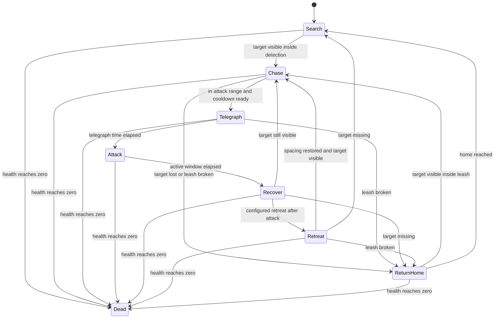

# EnemyController AI Report

Target: `EnemyController` baseline for `FE_ENEMY_MELEE_Shardling` and `FE_ENEMY_RANGED_BloomSpitter`.

`{{ENEMY_OR_AI_SYSTEM}}` was not resolved in the request, so this implementation covers the common enemy AI layer described in `docs/Product/MVP_BLUEPRINT.md`: `EnemyController`, `EnemyDefinition`, `Damageable`, and attack timing. It does not replace the existing `ProductionCombatSliceController` yet.

## Goal Fit

FOURFOLD ECHOES needs readable combat pressure from two normal enemy types in the vertical slice. This AI keeps the scope compact: one configurable FSM supports melee and ranged/basic variants without adding a behavior tree, inventory, quest, network, or open-world dependency.

## Systems Touched

- Enemy FSM: `Search`, `Chase`, `Telegraph`, `Attack`, `Recover`, `Retreat`, `ReturnHome`, `Dead`.
- Movement: `EnemyMotor` uses `NavMeshAgent` when present and falls back to top-down transform movement with obstacle sphere-cast checks.
- Sensing: `EnemySensor` handles target selection, detection radius, field of view, line of sight, and leash limits.
- Combat: `EnemyAttackDriver` resolves attack windows against `Damageable` targets.
- Animation: `EnemyAnimatorBridge` only forwards state/speed/triggers when matching Animator parameters exist.
- Health: `Damageable` owns health and death events; AI reacts to it but does not own health rules.

## Behavior State Diagram

## Configuration

Difficulty and behavior differences live in `EnemyDefinition` assets:

- health, move speed, angular speed, acceleration
- detection, lose-sight, field-of-view, leash, line-of-sight masks
- attack range, radius, arc, damage, telegraph, active, recovery, cooldown
- retreat distance and duration
- debug draw toggle

The verification builder creates two example definitions under `Assets/Generated/AI/Definitions` when run:

- `FE_ENEMY_MELEE_Shardling_AI`
- `FE_ENEMY_RANGED_BloomSpitter_AI`

## Verification

PlayMode tests:

- `EnemyController_TransitionsThroughCombatLoopAndDeath`
- `EnemyController_ReturnsHomeWhenTargetBreaksLeash`
- `EnemyController_LineOfSightBlocksSearchThroughWall`
- `EnemyMotor_FallbackMovementDoesNotPassThroughObstacle`

Reproducible scene:

- Menu: `FOURFOLD/AI/Build EnemyController Verification Scene`
- Output: `Assets/Scenes/AI_EnemyController_Verification.unity`
- Includes player target, LOS/movement wall, melee enemy, ranged enemy, generated definitions, colliders, and debug gizmos.

## Acceptance Conditions

- Search, chase, telegraph/attack, retreat, return-home, and death transitions are covered by tests.
- Leash prevents infinite pursuit.
- Line-of-sight can block detection through a wall.
- Transform fallback movement sphere-casts against obstacles; NavMeshAgent is used automatically when present.
- Animator parameters are optional and checked before being written, so existing controllers are not spammed with missing parameter calls.

## Known Follow-Up

The current production slice still uses `ProductionCombatSliceController` for enemy movement and damage. The next smallest useful task is to wire `EnemyController` and generated `EnemyDefinition` assets into `ProductionCombatSlice` or enemy prefabs, then remove duplicated hostile movement from the slice controller once scene validation passes.
