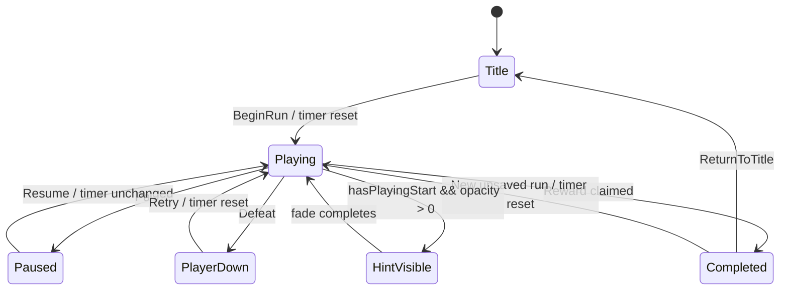

# Production Combat Onboarding Playing Timer

## Goal Support

This change supports the D020 vertical slice goal by keeping the controls hint available when a first-time player waits on the title overlay before starting the combat slice. The hint now starts its visible lifetime from the first `Playing` state instead of scene load.

## Systems Touched

- `ProductionCombatOnboardingHint` UI timing only.
- EditMode tests for state transition and fade behavior.

## Files Added/Changed

- `Assets/Scripts/ProductionCombatOnboardingHint.cs`
- `Assets/Tests/EditMode/ProductionCombatOnboardingHintTests.cs`
- `Assets/Tests/EditMode/ProductionCombatOnboardingHintTests.cs.meta`
- `reports/production-combat-onboarding-playing-timer.md`

## Implementation

- Locates `ProductionCombatSliceController` while the production combat scene is active.
- Records `playingStartedAt` only when the run enters `ProductionCombatRunState.Playing` from Title, retry, or completed states.
- Does not restart the timer on pause/resume, so the hint behaves like one onboarding cue for the current run.
- Keeps existing text, panel placement, and opacity timings.

## State Diagram

## Tests

- `UI_OnboardingHint_WaitsUntilGameplayStarts`
- `UI_OnboardingHint_ResetsWhenEnteringRunFromNonPlayableStates`
- `UI_OnboardingHint_DoesNotRestartDuringPauseResume`
- `UI_OnboardingHint_FadesAfterGameplayStart`
- `UI_OnboardingHint_HidesOutsidePlayingAndAfterFade`

## Acceptance Conditions

- Waiting on the title overlay cannot consume the controls hint lifetime.
- First gameplay entry shows the hint immediately.
- Pause/resume does not restart the onboarding cue.
- Retry from defeat can show the cue again for a fresh attempt.

## Next Smallest Useful Task

Add a tiny runtime evidence pass that captures the production combat slice immediately after `BeginRun` so UI readability can be checked without relying on manual timing.
