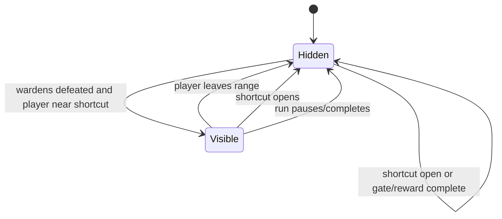

# Production Combat Shortcut Tool Prompt

## Goal Support

This lane moves the D020/D031 production combat slice closer to a first-time
five-minute playable route by making the post-warden shortcut interaction
visible in the game screen. It does not add inventory, quest log, open-world
travel, extra tools, or new combat systems.

## Systems Touched

- Runtime UI prompt for `ProductionCombatSlice`
- Existing `ProductionCombatSliceController` read-only state
- EditMode tests for prompt visibility rules and screen placement

## Files Added

- `Assets/Scripts/ProductionCombatShortcutToolPrompt.cs`
- `Assets/Scripts/ProductionCombatShortcutToolPrompt.cs.meta`
- `Assets/Tests/EditMode/ProductionCombatShortcutToolPromptTests.cs`
- `Assets/Tests/EditMode/ProductionCombatShortcutToolPromptTests.cs.meta`
- `reports/production-combat-shortcut-tool-prompt.md`

## Implementation

`ProductionCombatShortcutToolPrompt` bootstraps itself for
`ProductionCombatSlice` and draws a compact bottom prompt only when:

- gameplay is in `Playing`
- the minor wardens are defeated
- the shortcut is still unsolved
- the gate and reward are not already complete
- the player is near the shortcut node

The prompt text uses the current tool readiness value:

- ready: `Use the Echo Tool at this signal`
- recovering: `Stay close while the tool recharges`

## State Diagram

## Tests

- Prompt appears only after wardens are cleared and the player is near the
  unsolved shortcut.
- Prompt hides for paused state, live wardens, solved shortcut, open gate,
  claimed reward, and far player positions.
- Ready and recovering tool copy are deterministic.
- Prompt rectangle remains inside a narrow 320x240 screen.

## Acceptance Conditions

- A first-time player can see where to use the Echo Tool after clearing wardens.
- The prompt does not appear during earlier combat, pause, completion, or reward
  states.
- Existing movement, combat, save, reward claim, and objective cue behavior are
  not changed.

## Next Smallest Useful Task

Land the existing controller-input fix for the exploration tool, or recreate it
as a fresh narrow lane if the closed PR is intentionally abandoned.
