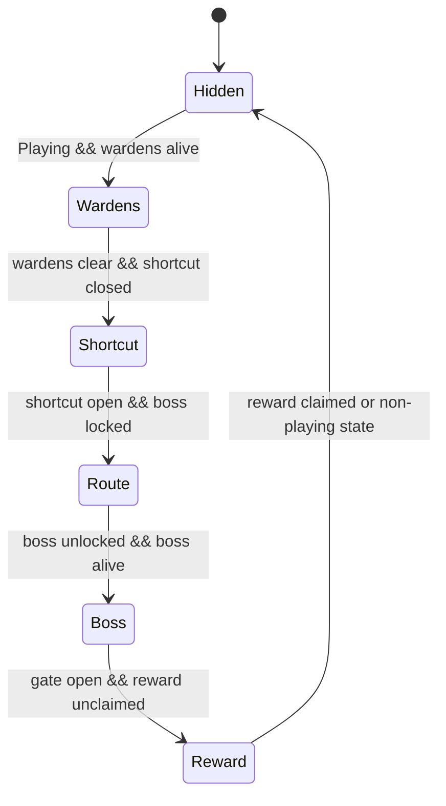

# Production Objective Mouse Prompts

## Goal Support

This change supports the D020 vertical slice by making the in-game "Next" prompt match the input options taught on the title and onboarding hints. Keyboard and mouse players now see the mouse/RMB actions while following the combat loop.

## Systems Touched

- Runtime objective prompt copy in `ProductionCombatObjectiveCue`.
- EditMode prompt-copy coverage.

## Files Added/Changed

- `Assets/Scripts/ProductionCombatObjectiveCue.cs`
- `Assets/Tests/EditMode/ProductionCombatObjectiveCueTests.cs`
- `reports/production-objective-mouse-prompts.md`

## Implementation

- Attack prompts now show `South Button / J / Mouse`.
- Echo Tool and reward claim prompts now show `North Button / E / RMB`.
- Objective ordering, state gating, panel placement, and gameplay behavior are unchanged.

## State Diagram

## Tests

- `UI_ObjectiveCue_ShowsControllerFirstActionPrompts`
- `UI_ObjectiveCue_ShowsMouseAttackPromptForBoss`
- Existing objective ordering and panel placement tests remain in place.

## Acceptance Conditions

- Combat prompts list controller, keyboard, and mouse attack inputs.
- Echo Tool and reward prompts list controller, keyboard, and RMB inputs.
- Non-playing states still hide the objective cue.
- The change does not add another tool, inventory, quest log, or open-world behavior.

## Next Smallest Useful Task

Add a PlayMode smoke that starts `ProductionCombatSlice`, advances into gameplay, and captures the HUD/objective prompt state for runtime evidence.
