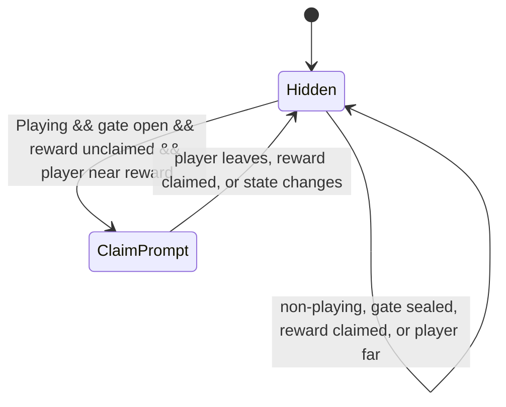

# Production Reward Controller-First Prompt

## Goal Support

This change supports the D020 vertical slice by keeping the live reward claim prompt aligned with the controller-first input language used by the title, onboarding hint, and objective cue.

## Systems Touched

- Runtime reward claim prompt copy.
- EditMode input prompt coverage.

## Files Added/Changed

- `Assets/Scripts/ProductionCombatRewardClaimPrompt.cs`
- `Assets/Tests/EditMode/ProductionCombatSliceInputTests.cs`
- `reports/production-reward-controller-first-prompt.md`

## Implementation

- The reward prompt detail now reads `North Button / E / RMB`.
- The prompt text is exposed through `BuildDetailText()` so the visible copy is covered by EditMode tests.
- Reward prompt range, state gating, and placement are unchanged.

## State Diagram

## Tests

- `Gameplay_RewardClaimInput_MatchesTitlePrompt`
- Existing reward prompt range and narrow-screen placement tests remain in place.

## Acceptance Conditions

- Reward claim prompt lists the controller input first.
- Keyboard and mouse inputs remain visible.
- Prompt visibility conditions are unchanged.
- The change does not add another tool, inventory, quest log, or open-world behavior.

## Next Smallest Useful Task

Add a PlayMode smoke that opens the reward gate and confirms the reward prompt appears near the chest in the production combat scene.
